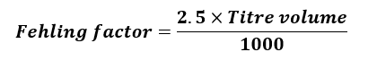
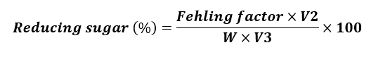

<b>Requirements (Instruments, Chemicals & Other) : </b>  

1.	Conical flask  
2.	HCL  
3.	NaOH  
4.	Sucrose  
5.	Phenolphthalein indicator  
6.	Fehling A solution  
7.	Fehling B solution  
8.	Analytical Balance  
9.	Sulphuric acid  
10.	Starch powder  
11.	1% α-amylase enzyme solution  
12.	Measuring cylinder  
13.	Distilled water  
14.	Volumetric flask   

<b>Procedure : </b> 

<b>Standardization of Fehling solution : </b>  

1.	Weigh 4.75 gm sucrose and transfer to a conical flask.  
2.	Pour 50 ml distilled water and add 5 ml conc. HCl, and allow to stand for 24 hr.  
3.	Neutralise the solution with 1N NaOH using phenolphthalein.  
4.	Transfer the solution to volumetric flask and makeup the volume to 500ml with water.  
5.	Take 25 ml solution into the 100 ml volumetric flask and make up the volume with water.  
6.	Take 5 ml of each Fehling A and Fehling B solutions in a conical flask, and add 10 ml water in the Fehling solution mixture.   
7.	Titrate the Fehling solution mixture with the standard invert sugar solution under boiling condition, using methylene blue indicator.   
8.  Calculate of Factor for Fehling’s solution (g of invert sugar) using formula:  
   

<b>Analysis of sample : </b>  

1.	Prepare 0.5% starch solution (Weigh 2.5 gm starch powder, transfer it to a 500 ml volumetric flask, dissolve with water and make the volume to 500ml)  
2.	Take 7 conical flask and pour 50 ml starch solution in each flask  
3.	Add 5 ml α-amylase enzyme solution (1%) in each flask  
4.	Treat the solution with enzyme for 0, 5, 10, 15 & 20 min and mark the flask T0, T1, T2, T3 and T4 respectively  
5.	Titrate the Fehling solution mixture with each of the enzyme treated starch solution   
6.	Calculate reducing sugar in different enzyme treated starch solution using formula:  
   

