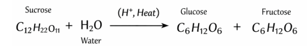
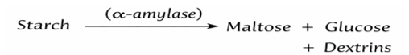

The hydrolysis of sucrose and starch involves the breakdown of complex carbohydrates into simpler sugars through chemical or enzymatic reactions. Understanding these reactions is important in food processing, brewing, confectionery, and bioethanol production. 

1. Hydrolysis of Sucrose (Acid-Catalyzed Inversion)
Sucrose is a disaccharide composed of glucose and fructose. In the presence of dilute acid (e.g., HCl) and heat, sucrose undergoes hydrolysis (inversion) to produce an equimolar mixture of glucose and fructose, known as invert sugar. 
Reaction Equation:  
 
This reaction increases reducing sugar content because both glucose and fructose are reducing sugars. Monitoring this reaction is important where sweetness, fermentability, and stability of syrups are critical. 
2. Hydrolysis of Starch (Enzymatic Action) 
Starch is a polysaccharide composed of amylose and amylopectin linked by α-1,4 and α-1,6 glycosidic bonds. Enzymatic hydrolysis is carried out using α-amylase, which cleaves α-1,4 bonds, producing maltose, dextrins, and glucose. 
Simplified Reaction: 
 
This process converts non-reducing polysaccharides into reducing sugars. 
3. Estimation of Reducing Sugars (Fehling’s Test) 

The extent of hydrolysis is determined by estimating reducing sugars using Fehling’s solution. 

Reaction Principle: 
 
Blue Cu²⁺ ions are reduced to brick-red copper(I) oxide (Cu₂O), indicating the presence of reducing sugars. The volume of sample required to reduce a known volume of Fehling’s solution allows calculation of reducing sugar concentration, which correlates with the degree of hydrolysis. 

This experiment helps in understanding chemical versus enzymatic hydrolysis, the role of acids and enzymes in glycosidic bond cleavage, and the quantitative estimation of reducing sugars to evaluate reaction rate and extent of hydrolysis. 

<!--The hydrolysis of sucrose and starch involves the breakdown of complex carbohydrates into simpler sugars through chemical or enzymatic reactions. Sucrose, a disaccharide, undergoes acid-catalyzed hydrolysis to yield glucose and fructose, while starch, a polysaccharide, breaks down into maltose and glucose through enzymatic action using amylase. Sucrose hydrolysis, also called inversion, can be achieved using dilute acids such as hydrochloric acid. The process produces an equimolar mixture of glucose and fructose, known as invert sugar. Monitoring this reaction is essential for industries where the sweetness and chemical stability of syrups are critical. Starch is hydrolyzed enzymatically using α-amylase, which cleaves the α-1,4 glycosidic bonds present in the amylose and amylopectin chains. The extent of hydrolysis can be determined by quantifying the reducing sugars produced during the reaction using Fehling’s solution. This process is critical in food, brewing, and bioethanol industries. Fehling’s solution is used to quantify reducing sugars in a sample. The reduction of copper(II) ions to copper(I) oxide forms a red precipitate, indicating the presence of reducing sugars. The titration results allow for calculating the amount of reducing sugars, which correlates with the extent of hydrolysis. The experiment aims to determine the hydrolysis rate and extent by analyzing the reducing sugars in hydrolyzed sucrose and starch samples, providing insights into enzymatic efficiency and reaction kinetics.
